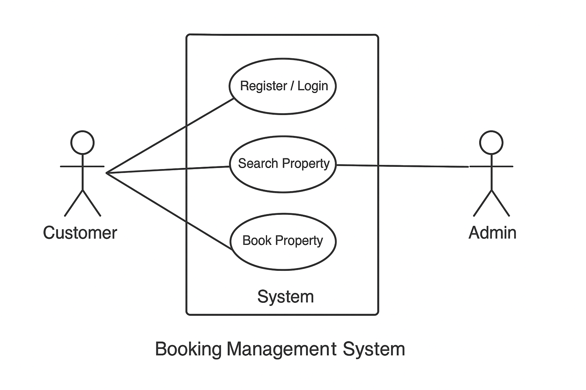

# Requirement Analysis in Software Development

## 📘 Introduction
This repository is dedicated to exploring and documenting the process of **Requirement Analysis** in software development.  
It includes definitions, examples, and practical exercises focused on understanding **functional and non-functional requirements**, **use case diagrams**, and the **importance of requirement validation** within the Software Development Life Cycle (SDLC).

---

## 🧩 Why is Requirement Analysis Important?

Requirement Analysis is a crucial phase in the **Software Development Life Cycle (SDLC)**. It defines *what* the system should do and ensures all stakeholders share a common understanding before development begins.

### Key Reasons:
1. **Prevents Miscommunication**
   - Helps bridge the gap between stakeholders and developers by clearly defining expectations.
2. **Reduces Development Costs**
   - Early identification of issues minimizes rework and ensures efficient use of time and resources.
3. **Ensures Project Success**
   - A clear and validated set of requirements ensures the final product meets business goals and user needs.

---

## ⚙️ Key Activities in Requirement Analysis

The process of Requirement Analysis involves several structured activities:

- **Requirement Gathering**
  - Collecting stakeholder needs through interviews, questionnaires, and workshops.
- **Requirement Elicitation**
  - Refining gathered requirements to ensure clarity and feasibility using techniques like brainstorming and prototyping.
- **Requirement Documentation**
  - Recording requirements in detailed documents such as Software Requirement Specifications (SRS) and use case descriptions.
- **Requirement Analysis and Modeling**
  - Analyzing relationships, dependencies, and constraints; visualizing them using models or diagrams.
- **Requirement Validation**
  - Reviewing requirements with stakeholders to confirm completeness, accuracy, and alignment with project objectives.

---

## 🧱 Types of Requirements

### 🔹 Functional Requirements
These describe **what the system should do** — the core features and behaviors visible to users.

**Examples (Booking Management System):**
- Users can **search for available properties** by location and date.
- The system allows **user registration and secure login**.
- Customers can **book, modify, or cancel a reservation**.
- Admins can **manage property listings and user accounts**.

### 🔸 Non-Functional Requirements
These define **how the system should perform**, focusing on performance, usability, and reliability rather than features.

**Examples (Booking Management System):**
- The system must **load each page within 2 seconds**.
- User data must be **encrypted** during transmission and storage.
- The system should support **up to 10,000 concurrent users**.
- The application must have **99.9% uptime** availability.

---

## 🎭 Use Case Diagrams

### What are Use Case Diagrams?
Use Case Diagrams are visual representations that show how **users (actors)** interact with a system’s **functions (use cases)**.  
They help identify system boundaries and ensure all interactions are captured early in the design phase.

### Benefits:
- Simplifies understanding of user interactions.
- Helps identify missing or redundant functionalities.
- Provides a communication bridge between stakeholders and developers.

### Booking Management System Use Case Diagram:

*(The image `alx-booking-uc.png` should be placed in this repository.)*

**Actors:**
- Customer  
- Admin  
- System  

**Use Cases:**
- Register / Login  
- Search Property  
- Book Property  
- Manage Booking  
- Manage Listings  

---

## ✅ Acceptance Criteria

### Importance:
Acceptance Criteria define the **conditions that must be met** for a feature to be accepted by stakeholders.  
They ensure clarity, guide testing, and prevent ambiguity in feature implementation.

### Example (Checkout Feature in Booking Management System):
**Feature:** Checkout and Payment

**Acceptance Criteria:**
- User must be logged in to proceed with checkout.  
- System displays booking summary and total amount.  
- User can select a payment method and confirm payment.  
- Confirmation email is sent after successful transaction.  
- Payment failure displays an appropriate error message.

---

## 🧾 Manual Check

All requirements, diagrams, and examples have been added as per project specifications.  
✅ Repository: [requirement-analysis](https://github.com/Waqo-Dida-Godana/requirement-analysis)  
✅ File: `README.md`  
✅ Image: `alx-booking-uc.png`
